|    NRP     |           Nama           |
| :--------: |      :------------:      |
| 5025251043 | Tri Zuyyina Rohmah       |

Todo App sederhana untuk mencatat dan mengatur tugas sehari-hari. Project ini dibuat untuk belajar dasar pengembangan web.

## Preview Todo-App
### Di browser
1. Light Mode
    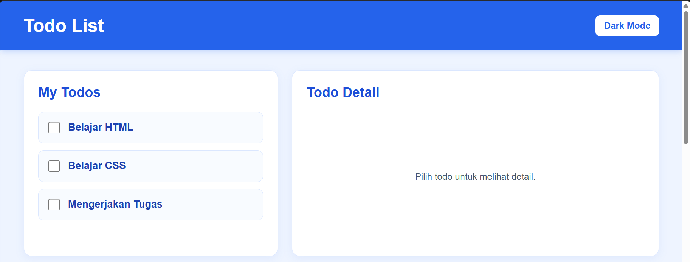
    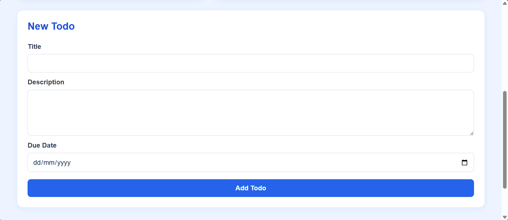
2. Dark Mode
    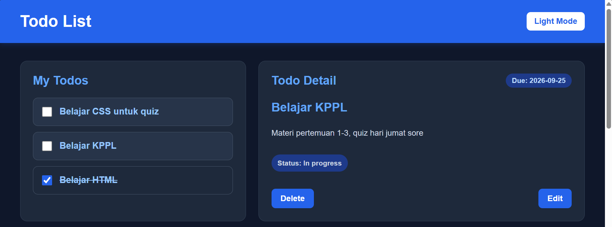
    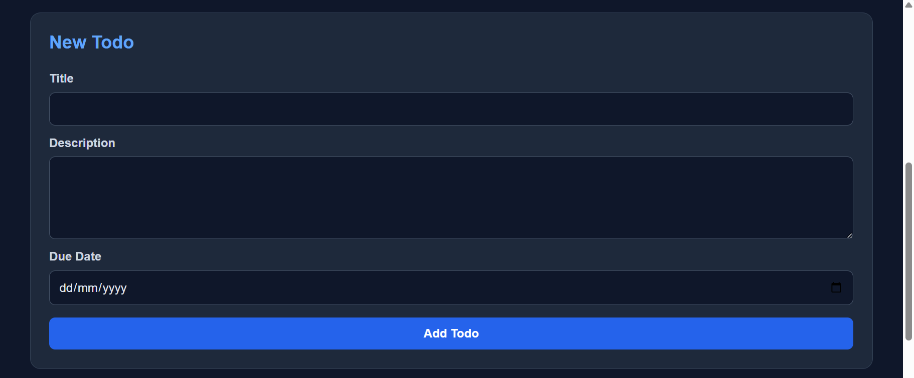

## Event Handler
1. Switch dark mode - light mode  
Terdapat fitur untuk berganti antara dark mode dan light mode di pojok kanan atas.
    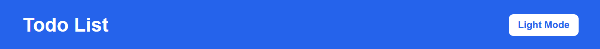
    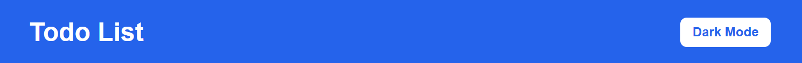

2. Todo-Detail 
Di bagian kanan, terdapat `section` Todo-Detail. Bagian ini berisi detail todo, seperti status, due date, dan deskripsi tambahan. Bagian ini akan berubah sesuai todo yang dipilih di `section` kiri
    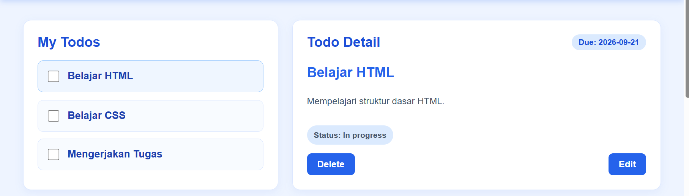

3. Ceklis 
Untuk tiap todo-list, terdapat check box yang berfungsi untuk menandai 'todo' sudah selesai dikerjakan atauu tidak. Todo yang telah ditandai selesai akan berpindah ke urutan paling bawah serta status nya di bagian Todo-Detail akan berubah dari `In Progress` menjadi `Completed` 

    Tampilan sebelum todo paling atas diceklis
    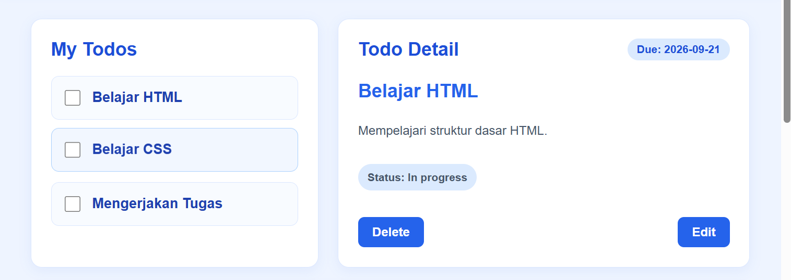

    Tampilan sesudah diceklis
    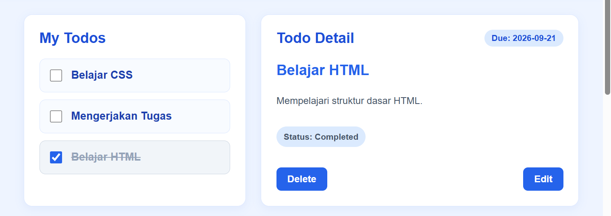

4. Edit Todo 
Di bagian Todo-Detail terdapat tombol `Edit` di pojok kanan bawah yang gunanya untuk mengubah judul, deskripsi, dan due date. Jika perubahan telah selesai dilakukan, terdapat dua pilihan tombol, `Save` untuk menyimpan dan `Cancel` untuk membatalkan perubahan.

    Sebelum diedit
    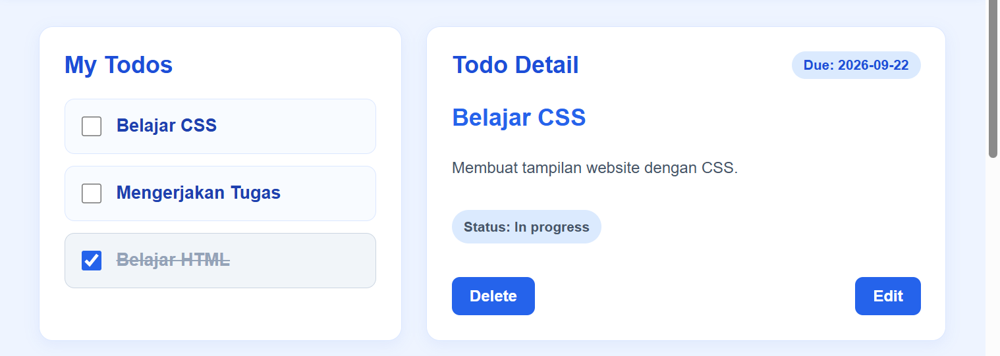

    Mengubah judul todo
    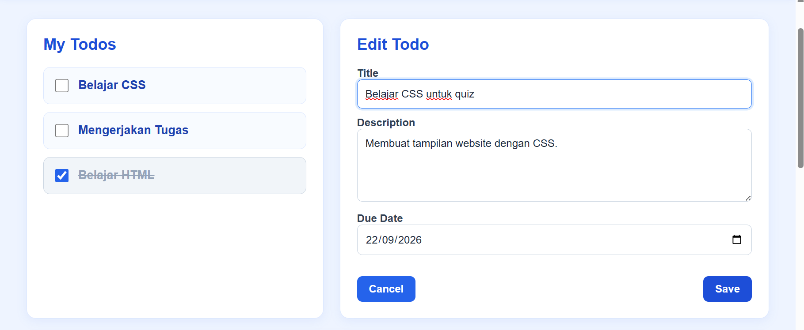

    Tampilan setelah diubah
    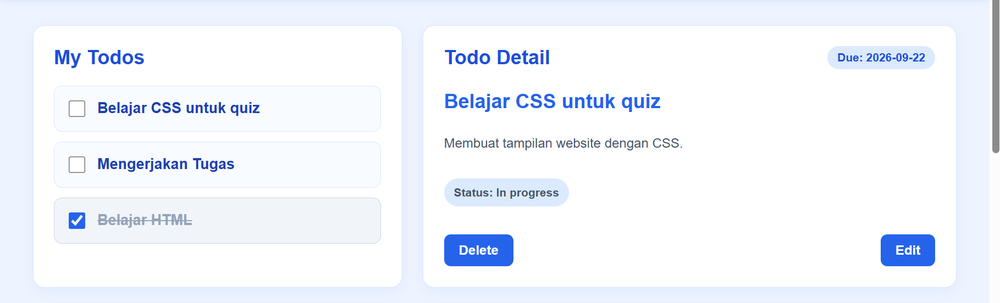

5. Delete Todo 
Selain `Edit`, juga terdapat tombol `Delete` di pojok kiri bawah Todo-Detail. Ini berfungsi untuk menghapus todo agar tidak bertumpuk. `Delete` tidak hanya terbatas pada todo yang telah diceklis. Sebelum benar benar terhapus akan ada konfirmasi terakhir apakah pengguna benar-benar ingin menghapus todo.

    Sebelum dihapus
    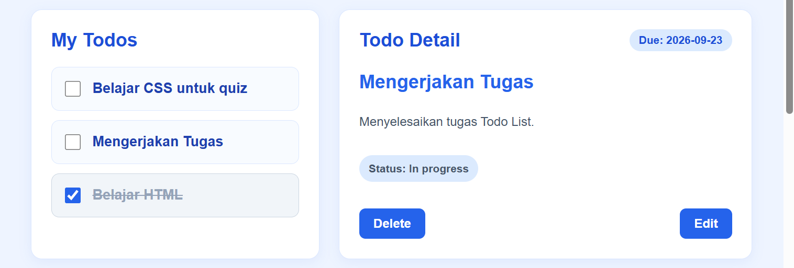

    Konfirmasi sebelum benar-benar dihapus
    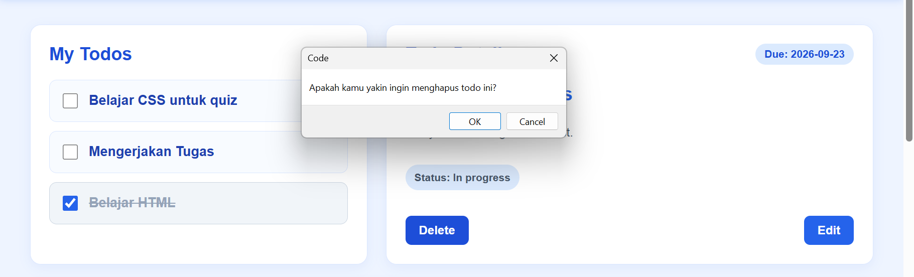

    Todo telah terhapus dari daftar
    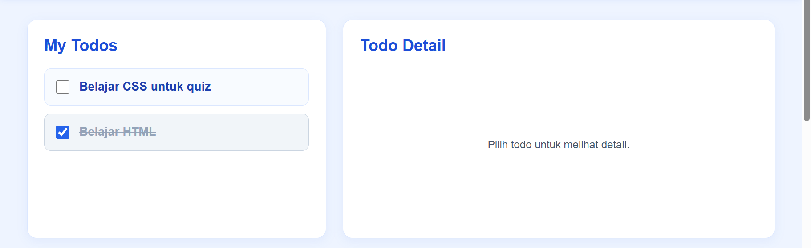

6. Add New Todo 
Di bagian paling bawah Todo-App, terdapat form untuk menambahkan todo baru

    Form Add-Todo
    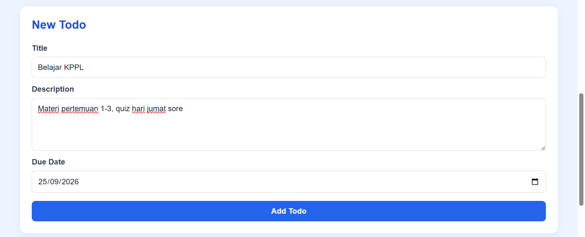
    
    List todo akan diperbarui
    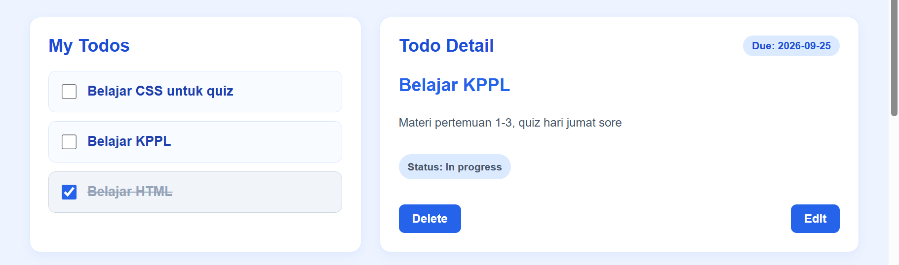
